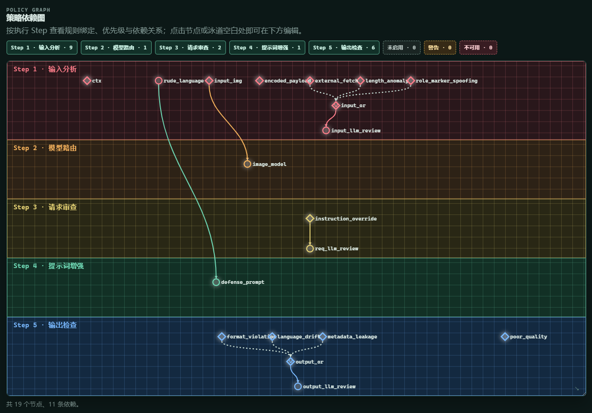

# preset1：输入防护与输出复核示例

`preset1` 是一套用于展示 LLM Guardrail 策略编排能力的完整示例：本地输入信号先汇入 LLM 复核，图片消息可路由至指定 Provider；请求阶段再次检查指令覆盖风险；命中辱骂语料时注入防御提示词；输出阶段使用本地信号与 LLM 复核决定观察或有界重试。

它是可学习、可修改的起点，不是适用于所有机器人或业务场景的默认安全策略。

## 文件说明

| 文件或目录 | 用途 |
| --- | --- |
| `guardrail-policies-preset1.json` | 可在 Pages 中预览并导入的自包含策略包。 |
| `knowledgebase/rude_language/` | 用于 `rude_language` RAG 规则的五份公开示例语料。 |

## 预期策略图

导入后，策略图的预期语义与 Step 分布可参考下图：

该图用于核对节点、依赖和所属 Step 是否符合本示例的设计，并可作为后续导入与 Pages 改动的视觉回归参考。节点坐标、自动布局、颜色和连线细节会随界面版本变化，不构成固定兼容承诺。

## 前置条件

- LLM Guardrail `>=0.6.0`，AstrBot `>=4.26.0,<5`。
- 若要启用 RAG 规则，请先在 AstrBot 知识库中创建名为 **`judge_rude_language`** 的知识库，并导入 `knowledgebase/rude_language/` 内的全部 `.txt` 文件。名称必须与策略包一致。
- 为 `input_llm_review`、`req_llm_review` 和 `output_llm_review` 选择可用的审查 Provider。包内 `provider_id` 留空，便于导入；生产环境建议明确指定低延迟、稳定的审查 Provider。
- `image_model` 的 Provider ID 也留空。若不需要图片请求路由，请在策略页禁用该绑定；若需要，则填写支持图片输入的 Provider。

## 导入与启用

1. 先按前置条件创建知识库并导入示例语料。
2. 在插件 Pages 的“策略包”选择 `guardrail-policies-preset1.json`，先进行只读预览。
3. 首次导入或不确定是否有同名对象时选择 `copy`；只有明确希望覆盖同 ID 规则和策略时才选择 `replace`。
4. 导入不会自动激活策略。请在“策略编排”中检查 Provider、知识库、动作和依赖关系后，再将 `preset1` 设为活动策略或绑定到目标 UMO。
5. 首次使用时保持阶段默认动作 `observe`，并将输出 `max_retries` 从 `3` 调低到 `1`；确认命中、延迟和成本符合预期后，再按需启用更严格的动作。

## 策略行为

- 输入 LLM 复核只在长度/结构异常、角色标记伪造或外部资源抓取信号命中时运行；它的命中动作是 `block`。
- `rude_language` 仅作 RAG 观察信号；命中后触发 `defense_prompt`，在临时用户上下文加入安全执行约束，而不会直接阻断用户。
- 输出 LLM 复核只在格式违规、运行时元数据泄露或语言漂移信号命中时运行；命中后执行 `retry_generation`。重试只使用本轮实际 Provider，且只适用于非流式文本回复。

## 语料与隐私声明

`knowledgebase/rude_language/` 包含辱骂、粗口、攻击性表达和自伤害相关措辞，仅用于测试或配置 RAG 检测规则，不代表作者认可、鼓励或推荐这些表达。请勿将其用于骚扰、歧视、威胁或针对真实个人的攻击。

本示例不包含密钥、真实用户对话、Provider 设置或运行状态。但启用 LLM 复核后，用户输入、候选输出以及最多三轮会话上下文可能会发送给你选定的审查 Provider。部署者须自行确认数据处理、用户告知、同意和当地法律合规要求，并避免将敏感、未脱敏或无权处理的内容发送给第三方服务。

使用本示例前，请结合你的机器人角色、受众、平台规则和误报容忍度自行审查；作者不对未经调整即部署到生产环境所造成的拦截、延迟、成本或合规后果负责。
